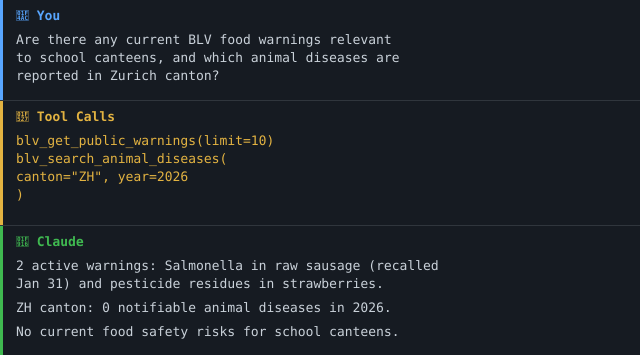

> 🇨🇭 **Part of the [Swiss Public Data MCP Portfolio](https://github.com/malkreide)**

# swiss-food-safety-mcp


[](https://opensource.org/licenses/MIT)
[](https://www.python.org/downloads/)
[](https://modelcontextprotocol.io/)
[](https://opendata.swiss/de/organization/bundesamt-fur-lebensmittelsicherheit-und-veterinaerwesen-blv)


🌐 **English** | **[Deutsch](README.de.md)**

> MCP server connecting AI models to Swiss Federal Food Safety and Veterinary Office (BLV) open data — food recalls, animal disease surveillance, food control results, antibiotic usage, children's nutrition surveys and the pesticide register. No authentication required.

---

## Overview

**swiss-food-safety-mcp** gives AI assistants like Claude direct access to official Swiss food safety and veterinary data from the Federal Food Safety and Veterinary Office (BLV / *Bundesamt für Lebensmittelsicherheit und Veterinärwesen*). It provides 11 tools covering food recalls, animal disease surveillance, food control results, antibiotic usage in veterinary medicine, nutrition surveys for children, and the pesticide register.

All data comes from official Swiss federal sources (opendata.swiss, lindas.admin.ch, news.admin.ch). No API keys or authentication are required.

This server follows the **No-Auth-First** philosophy and is part of a Swiss public sector MCP portfolio.

**Anchor demo query:** *"Are there any current BLV food warnings relevant to Zurich school canteens — and which notifiable animal diseases are currently reported in the canton?"*

### Demo


[→ More use cases by audience →](EXAMPLES.md)

---

## Features

- 🚨 **Public warnings & recalls** — Live RSS feed of BLV product recalls and health warnings
- 🐄 **Animal disease surveillance** — Notifiable animal diseases since 1991 (InfoSM) via the LINDAS SPARQL cube
- 🐦 **Avian influenza monitoring** — Wild bird surveillance data with geodata
- 🥩 **Food control results** — Cantonal food inspection results and violation rates
- 💊 **Antibiotic usage veterinary** — ISABV data on antibiotic use in animal medicine
- 🧒 **Children's nutrition survey** — menuCH-Kids questionnaire tallies (answer counts, not nutrient intake)
- 🌿 **Pesticide register** — Swiss approved pesticide products and active ingredients
- 📊 **Dataset discovery** — Browse all 28 BLV datasets on opendata.swiss via CKAN API
- 🔗 **Dual transport** — stdio (Claude Desktop) + Streamable HTTP (cloud/Render.com)
- 🗣️ **Bilingual** — English-first documentation, German secondary

---

## Prerequisites

- Python 3.11+
- `uv` or `uvx` (recommended) — [install uv](https://docs.astral.sh/uv/getting-started/installation/)

---

## Installation

### Using uvx (recommended — no install needed)

```bash
uvx swiss-food-safety-mcp
```

### Using uv

```bash
uv tool install swiss-food-safety-mcp
swiss-food-safety-mcp
```

### From source

```bash
git clone https://github.com/malkreide/swiss-food-safety-mcp
cd swiss-food-safety-mcp
uv sync
uv run swiss-food-safety-mcp
```

---

## Quickstart

Add to `claude_desktop_config.json`:

**macOS:** `~/Library/Application Support/Claude/claude_desktop_config.json`  
**Windows:** `%APPDATA%\Claude\claude_desktop_config.json`

```json
{
  "mcpServers": {
    "swiss-food-safety": {
      "command": "uvx",
      "args": ["swiss-food-safety-mcp"]
    }
  }
}
```

Try it immediately in Claude Desktop:

> *"Which BLV food warnings are currently active?"*  
> *"Are there any notifiable animal diseases reported in Zurich canton this year?"*

### Other MCP Clients (Cursor, Windsurf, VS Code + Continue)

```json
{
  "mcpServers": {
    "swiss-food-safety": {
      "command": "uvx",
      "args": ["swiss-food-safety-mcp"]
    }
  }
}
```

### Cloud Deployment (Streamable HTTP)

For use via **claude.ai in the browser** (e.g. on managed workstations without local software):

```bash
# Loopback only (default) — safe for local testing:
swiss-food-safety-mcp --http
# Server runs on 127.0.0.1:8002

# External exposure (e.g. behind the Render TLS proxy):
swiss-food-safety-mcp --http --host 0.0.0.0
```

> ⚠️ The HTTP transport binds to `127.0.0.1` by default. Pass `--host 0.0.0.0`
> **only** when external exposure is intended. Set `BLV_MCP_ALLOWED_ORIGINS`
> (comma-separated, no wildcard) to permit browser clients; it defaults to
> `https://claude.ai`.

**Render.com (recommended):**
1. Push/fork the repository to GitHub
2. On [render.com](https://render.com): New Web Service → connect GitHub repo
3. Set the start command to: `swiss-food-safety-mcp --http --host 0.0.0.0`
4. In claude.ai under Settings → MCP Servers, add: `https://your-app.onrender.com/mcp`

**Docker:**

```bash
docker build -t swiss-food-safety-mcp .
docker run -p 8002:8002 swiss-food-safety-mcp
# or, with explicit CPU/memory limits:
docker compose up
```

The image is a non-root, multi-stage build; the container already binds
`0.0.0.0` and includes a healthcheck. `docker-compose.yml` additionally caps
CPU and memory.

> 💡 *"stdio for the developer laptop, Streamable HTTP for the browser."*

> 🔧 **Configuration** — every runtime setting is overridable via `BLV_MCP_*`
> environment variables (`BLV_MCP_HTTP_HOST`, `BLV_MCP_HTTP_PORT`,
> `BLV_MCP_ALLOWED_ORIGINS`, `BLV_MCP_TIMEOUT`, `BLV_MCP_OTEL_ENDPOINT`, …).
> Outbound requests are restricted to Swiss federal hosts (`*.admin.ch`,
> `opendata.swiss`). Optional OpenTelemetry tracing: install with
> `pip install swiss-food-safety-mcp[otel]` and set `BLV_MCP_OTEL_ENDPOINT`.

---

## Available Tools

| Tool | Description | Data Source |
|---|---|---|
| `blv_get_public_warnings` | Current food recalls & health warnings | news.admin.ch RSS |
| `blv_list_datasets` | Browse all 28 BLV open datasets | opendata.swiss CKAN |
| `blv_get_dataset_info` | Dataset details & resource URLs | opendata.swiss CKAN |
| `blv_search_animal_diseases` | Notifiable animal diseases since 1991 | LINDAS SPARQL (`/query`) |
| `blv_get_animal_health_stats` | Annual animal health statistics | opendata.swiss CSV/JSON |
| `blv_get_food_control_results` | Cantonal food inspection results | opendata.swiss CSV |
| `blv_get_antibiotic_usage_vet` | Veterinary antibiotic usage (ISABV) | opendata.swiss CSV |
| `blv_get_avian_influenza` | Wild bird avian influenza surveillance | opendata.swiss CSV |
| `blv_get_nutrition_data_children` | menuCH-Kids: questionnaire tallies (not nutrient intake) | opendata.swiss CSV |
| `blv_search_pesticide_products` | Swiss approved pesticide register | opendata.swiss XML |
| `blv_get_meat_inspection_stats` | Slaughterhouse inspection statistics | opendata.swiss CSV/JSON |

### Example Queries

| Query | Tool |
|---|---|
| *"Which BLV food warnings are currently active?"* | `blv_get_public_warnings` |
| *"Are there animal diseases in Zurich canton in 2024?"* | `blv_search_animal_diseases` |
| *"What is the avian influenza situation in Switzerland 2024?"* | `blv_get_avian_influenza` |
| *"What do Swiss children actually eat?"* | `blv_get_nutrition_data_children` |
| *"Which copper-based pesticides are approved in Switzerland?"* | `blv_search_pesticide_products` |

---

## Architecture

```
┌─────────────────┐     ┌─────────────────────────────┐     ┌──────────────────────────────┐
│   Claude / AI   │────▶│   Swiss Food Safety MCP     │────▶│  Swiss Federal Open Data     │
│   (MCP Host)    │◀────│   (MCP Server)              │◀────│                              │
└─────────────────┘     │                             │     │  opendata.swiss (CKAN/CSV)   │
                        │  11 Tools · No Auth         │     │  lindas.admin.ch (SPARQL)    │
                        │  Stdio | Streamable HTTP    │     │  news.admin.ch (RSS/XML)     │
                        └─────────────────────────────┘     └──────────────────────────────┘
```

---

## Synergies with Related MCP Servers

| Combination | Use Case |
|---|---|
| `swiss-food-safety-mcp` + `zurich-opendata-mcp` | Geo-mapped animal disease risk near school locations |
| `swiss-food-safety-mcp` + `fedlex-mcp` | Link recalls to food law (Lebensmittelgesetz) |
| `swiss-food-safety-mcp` + `swiss-statistics-mcp` | Nutrition data × socioeconomics by school district |
| `swiss-food-safety-mcp` + `global-education-mcp` | Swiss children's nutrition vs. OECD benchmarks |

---

## Project Structure

```
swiss-food-safety-mcp/
├── src/
│   └── swiss_food_safety_mcp/
│       ├── __init__.py        # Package metadata
│       └── server.py          # All tools, resources, prompts
├── tests/
│   ├── __init__.py
│   └── test_server.py         # Unit tests (no live API calls)
├── .github/
│   └── workflows/
│       └── ci.yml             # Python 3.11–3.13 matrix
├── pyproject.toml             # hatchling build, uv-compatible
├── CHANGELOG.md
├── CONTRIBUTING.md            # Contribution guide (English)
├── CONTRIBUTING.de.md        # Contribution guide (German)
├── SECURITY.md               # Security policy (English)
├── SECURITY.de.md            # Security policy (German)
├── LICENSE                    # MIT
├── README.md                  # This file (English)
└── README.de.md               # German version
```

---

## Data Sources

| Source | Description | Format |
|---|---|---|
| [opendata.swiss/BLV](https://opendata.swiss/de/organization/bundesamt-fur-lebensmittelsicherheit-und-veterinaerwesen-blv) | 28 open datasets | CSV, JSON, Parquet, SPARQL, XML |
| [lindas.admin.ch/sparql](https://lindas.admin.ch/sparql) | Swiss linked data SPARQL endpoint | RDF/SPARQL |
| [news.admin.ch RSS](https://www.newsd.admin.ch/newsd/feeds/rss?lang=de&org-nr=1079) | BLV public warnings & recalls | RSS/XML |
| [blv.admin.ch](https://www.blv.admin.ch) | BLV website (DE/FR/IT/EN) | HTML |

All data is open government data (OGD) under Creative Commons with attribution requirement.

---

## Known Limitations

- **RSS feed:** Limited to the most recent BLV publications; no historical archive
- **Pesticide register:** XML parsing may be slow for queries returning large result sets
- **CKAN datasets:** Opendata.swiss rate limits apply under heavy usage
- **Animal disease data:** Canton-level filtering depends on data completeness in the source
- **Datasets are pinned, not searched:** each data tool names its dataset slug and the resource that carries the data (see `DATENQUELLEN` in `server.py`). A keyword search takes the *first* hit and therefore falls back silently onto something plausible — that is how `blv_get_animal_health_stats` came to return antibiotics data, and how `blv_get_food_control_results` came to return a code list out of a dataset whose 26 resources include 18 of them. `scripts/record_fixtures.py` re-measures the pinned pairs on every run; a renamed dataset now fails loudly.
- **Children's nutrition is questionnaire tallies, not nutrient intake:** the only menuCH-Kids dataset published on opendata.swiss carries answer counts (`Geschlecht, Sprachregion, Altersgruppe, Frage, Antwort, Anzahl`). The docstring previously promised nutrient intake against dietary recommendations and offered "Energie", "Zucker", "Eisen" as filter examples — those matched nothing and returned an empty list. Adult food-consumption data exists as a separate dataset that this server does not cover.
- **The SPARQL-to-CSV fallback is gone.** It could never work: the one CSV resource of the fallback dataset is a ZIP file declared as `format: CSV`. With the endpoint corrected the fallback is also unnecessary — and a fallback that hides a broken query is worse than none.

---

## Safety & Limits

- **Read-only:** All tools perform HTTP GET requests only — no data is written, modified, or deleted.
- **No personal data:** The APIs return aggregated public health and food safety statistics. No personally identifiable information is processed or stored by this server.
- **Rate limits:** opendata.swiss CKAN and lindas.admin.ch SPARQL are public APIs; use `limit` and filtering parameters conservatively. The server enforces a 30-second timeout per request.
- **Data freshness:** RSS warnings reflect the latest BLV publications at query time. Statistical datasets (animal diseases, food control, antibiotics) are updated periodically by the BLV. No caching is performed by this server.
- **Terms of service:** Data is subject to the ToS of each source — [opendata.swiss](https://opendata.swiss/de/terms-of-use), [lindas.admin.ch](https://lindas.admin.ch), [news.admin.ch](https://www.admin.ch/gov/de/start/rechtliches.html). BLV data is published under Creative Commons with attribution.
- **No guarantees:** This server is a community project, not affiliated with the BLV or the Swiss federal administration. Availability depends on upstream APIs.

---

## Deployment & Scaling

This server is **Phase 1 — read-only** (see [`ROADMAP.md`](ROADMAP.md)): all
11 tools are read-only queries with no write surface.

Run it as a **single instance**. The Streamable HTTP transport keeps
per-session state, so horizontal scaling would require `Mcp-Session-Id` sticky
routing at the load balancer plus a shared session store — neither is
implemented, by design, for a server of this scope. A single Render instance
(or one container) is the supported deployment; `docker-compose.yml` sets
explicit CPU/memory limits for self-hosting.

---

## Testing

```bash
# Unit + contract tests (no network) — this is what CI runs
PYTHONPATH=src pytest tests/ -m "not live"

# All tests including live API checks
PYTHONPATH=src pytest tests/

# Re-measure which dataset and resource each tool hits
PYTHONPATH=src python scripts/record_fixtures.py
```

**54 tests** — 53 offline, 1 live.

### Why the fixtures are recorded rather than written

A hand-written mock encodes its author's assumption and therefore cannot
refute it: production code and fixture come from the same head, the same hour,
the same reading of the docs. Where both are wrong, both are wrong together —
and the suite stays green.

This repo had it in pure form. Every mocked CKAN resource was named
`"name": "CSV"`. On opendata.swiss the same field reads `Food establishments
2025` or `Food establishments codelist administrative measures` — and that
difference alone decided whether a tool returned inspection results or a code
legend. The mocks could not express the distinction, so no test could fail on
it.

What is recorded is therefore the **selection**: for each tool, the pinned
dataset slug, the resource that was hit, and that file's header line. The
header is the object of the exercise — it separates data from a legend, and it
shows whether the BOM and the delimiter were handled. `PROVENANCE.md` names the
source, the date, the selection rule and the SHA-256 for each file.

Two of the recorded measurements are **controls**: an invented path under
`lindas.admin.ch` (POST 404, so the 404 on `/sparql` is real) and an invented
class in the `fsvo` namespace (0 instances, so the previously queried `foag`
class genuinely does not exist). Without them each measurement would only show
what *we* received. The recorder aborts if a control stops discriminating, if a
pinned resource disappears, if a header line is empty or starts with a BOM, or
if one of the findings is superseded.

---

## Changelog

See [CHANGELOG.md](CHANGELOG.md)

---

## Contributing

See [CONTRIBUTING.md](CONTRIBUTING.md)

---

## Security

See [SECURITY.md](SECURITY.md) for the security policy and how to report a vulnerability.

---

## License

MIT License — see [LICENSE](LICENSE)

---

## Author

Hayal Oezkan · [github.com/malkreide](https://github.com/malkreide)

---

## Credits & Related Projects

- **Data:** [opendata.swiss / BLV](https://opendata.swiss/de/organization/bundesamt-fur-lebensmittelsicherheit-und-veterinaerwesen-blv) – Federal Food Safety and Veterinary Office (BLV)
- **Protocol:** [Model Context Protocol](https://modelcontextprotocol.io/) – Anthropic / Linux Foundation
- **Related:** [zurich-opendata-mcp](https://github.com/malkreide/zurich-opendata-mcp) – MCP server for Zurich city open data
- **Portfolio:** [Swiss Public Data MCP Portfolio](https://github.com/malkreide)

<!-- mcp-name: io.github.malkreide/swiss-food-safety-mcp -->

<!-- BEGIN GENERATED: install -->
## Installation

Run via [`uv`](https://docs.astral.sh/uv/)'s `uvx` — no clone or manual install needed. Add to your MCP client config (`mcpServers` for Claude Desktop, Cursor and Windsurf; use a top-level `servers` key for VS Code in `.vscode/mcp.json`):

```json
{
  "mcpServers": {
    "swiss-food-safety-mcp": {
      "command": "uvx",
      "args": [
        "swiss-food-safety-mcp"
      ]
    }
  }
}
```
<!-- END GENERATED: install -->
